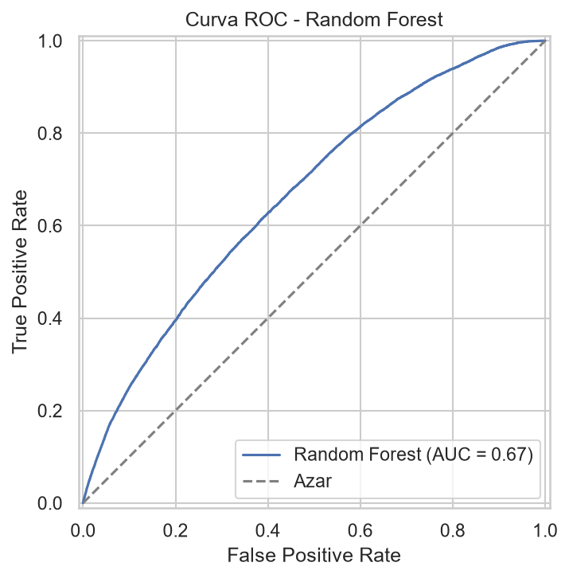
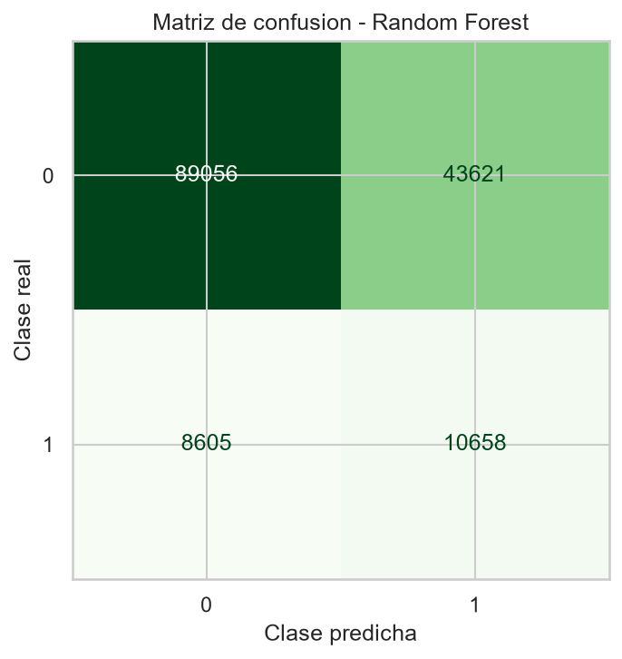
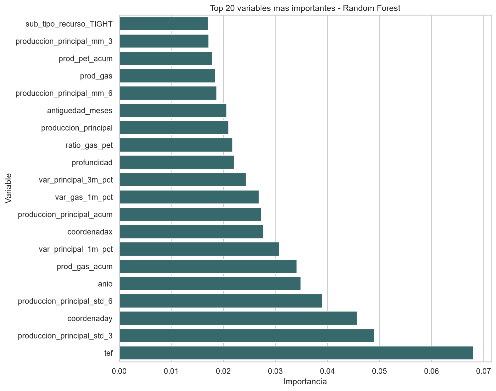

# Predicción de caída crítica de producción mensual en pozos no convencionales

Proyecto final del curso **Data Science I**.

El objetivo del proyecto es construir una primera solución reproducible de machine learning para anticipar si un pozo no convencional de petróleo o gas tendrá una **caída crítica de producción en el mes calendario siguiente**.

## Resumen

Este trabajo formula el problema como una tarea de **clasificación binaria supervisada** a nivel **pozo-mes**. Cada fila del dataset representa el estado productivo de un pozo en un mes determinado.

La variable objetivo es `caida_critica`:

- `caida_critica = 1`: el pozo presenta una caída del 30% o más en su producción principal durante el mes calendario siguiente.
- `caida_critica = 0`: el pozo no presenta una caída crítica bajo ese criterio.

Para definir la producción principal:

- se usó `prod_pet` en pozos petrolíferos;
- se usó `prod_gas` en pozos gasíferos.

El mejor modelo evaluado fue **Random Forest**, con ROC AUC de `0,667` y recall de la clase positiva de `0,553`. El modelo debe interpretarse como una **primera aproximación académica**, no como una herramienta lista para operación.

## Fuente de datos

El dataset proviene de datos abiertos oficiales de Argentina:

**Producción de pozos de gas y petróleo no convencional**

Link de referencia:

http://datos.energia.gob.ar/dataset/c846e79c-026c-4040-897f-1ad3543b407c/archivo/b5b58cdc-9e07-41f9-b392-fb9ec68b0725

Los datos crudos no se versionan en Git. Deben ubicarse localmente en:

```text
data/raw/
```

## Dataset final

El dataset final de modelado se generó en:

```text
data/processed/model_dataset.csv
```

Resumen del dataset final:

| Característica | Valor |
|---|---:|
| Registros | 319.453 |
| Columnas | 77 |
| Pozos únicos | 4.681 |
| Rango temporal modelable | Enero 2006 a marzo 2026 |
| Unidad de análisis | Pozo-mes |

Distribución del target:

| Clase | Significado | Cantidad | Porcentaje |
|---|---|---:|---:|
| 0 | Sin caída crítica futura | 281.723 | 88,19% |
| 1 | Con caída crítica futura | 37.730 | 11,81% |

El target está desbalanceado, por lo que la evaluación no se basó únicamente en accuracy. Se priorizaron también ROC AUC, recall, precisión y F1-score.

## Metodología

El flujo del proyecto se desarrolló en notebooks secuenciales:

1. **Calidad de datos**
   - carga del dataset;
   - revisión de columnas, tipos de datos, nulos, duplicados, negativos y ceros;
   - generación de una base procesada inicial.

2. **EDA**
   - análisis temporal;
   - producción por provincia, cuenca, empresa y tipo de pozo;
   - distribuciones, outliers, ceros y comportamiento por pozo;
   - análisis exploratorio de variaciones futuras y umbrales de caída crítica.

3. **Feature engineering**
   - construcción formal del target `caida_critica`;
   - validación de continuidad mensual;
   - creación de variables históricas sin leakage;
   - generación del dataset final de modelado.

4. **Modelado**
   - split temporal, no aleatorio;
   - pipelines de preprocesamiento;
   - Logistic Regression como baseline;
   - Random Forest como modelo no lineal inicial;
   - comparación de métricas e interpretabilidad.

5. **Resultados para reporte**
   - consolidación de métricas, figuras y textos finales para el informe.

## Prevención de data leakage

El proyecto cuida especialmente la temporalidad:

- las variables predictoras usan información del mes actual o de meses anteriores;
- las variables del mes siguiente solo se usan para construir el target;
- se exige continuidad mensual para calcular `caida_critica`;
- se usa split temporal en lugar de split aleatorio;
- el preprocesamiento se realiza dentro de pipelines de scikit-learn.

Variables futuras o auxiliares excluidas como features:

- `produccion_principal_next`
- `fecha_siguiente_observada`
- `gap_meses_hasta_siguiente`
- `var_futura_principal_pct`
- `prod_pet_next`
- `prod_gas_next`

## Modelos evaluados

Se compararon dos modelos con el mismo split temporal:

- **Logistic Regression**
  - baseline interpretable;
  - `class_weight="balanced"`;
  - preprocesamiento dentro de `Pipeline`.

- **Random Forest**
  - modelo no lineal inicial;
  - parámetros conservadores para reducir riesgo de overfitting;
  - `class_weight="balanced"`;
  - preprocesamiento dentro de `Pipeline`.

## Resultados

| Modelo | ROC AUC | Accuracy | Precisión | Recall | F1-score |
|---|---:|---:|---:|---:|---:|
| Logistic Regression | 0,632 | 0,625 | 0,179 | 0,548 | 0,270 |
| Random Forest | 0,667 | 0,656 | 0,196 | 0,553 | 0,290 |

El mejor modelo fue **Random Forest**, ya que obtuvo mejores valores de ROC AUC, accuracy, precisión y F1-score, con un recall de clase positiva levemente superior al baseline.

La matriz de confusión del Random Forest en test fue:

| Clase real / predicha | Predice 0 | Predice 1 |
|---|---:|---:|
| Real 0 | 89.056 | 43.621 |
| Real 1 | 8.605 | 10.658 |

Los falsos negativos representan pozos-mes con caída crítica real que el modelo no anticipa. Por eso el recall de la clase positiva es una métrica clave. Aun así, la baja precisión indica que el modelo genera muchas falsas alarmas.

## Figuras principales

Curva ROC del modelo Random Forest:



Matriz de confusión del modelo Random Forest:



Importancia de variables del modelo Random Forest:



## Estructura del repositorio

```text
proyecto-caida-produccion-pozos/
├── data/
│   ├── raw/                 # datos crudos, no versionados
│   ├── processed/           # datasets procesados
│   └── external/            # fuentes externas opcionales
├── notebooks/
│   ├── 01_data_quality.ipynb
│   ├── 02_eda.ipynb
│   ├── 03_feature_engineering.ipynb
│   ├── 04_modeling.ipynb
│   └── 05_results_for_report.ipynb
├── reports/
│   ├── figures/             # gráficos generados
│   ├── final_report_notes.md
│   └── google_docs_final.md
├── models/                  # modelos serializados
├── docs/
├── prompts/
├── requirements.txt
├── README.md
├── .gitignore
└── copilot-instructions.md
```

## Cómo reproducir el proyecto

1. Clonar el repositorio.
2. Crear un entorno virtual.
3. Instalar dependencias:

```bash
pip install -r requirements.txt
```

4. Descargar el dataset oficial y ubicarlo en `data/raw/`.
5. Ejecutar los notebooks en orden:

```text
01_data_quality.ipynb
02_eda.ipynb
03_feature_engineering.ipynb
04_modeling.ipynb
05_results_for_report.ipynb
```

## Entregables principales

- Dataset final de modelado: `data/processed/model_dataset.csv`
- Métricas comparativas: `reports/model_metrics.csv`
- Modelo seleccionado: `models/modelo_clasificacion_caida_critica.joblib`
- Figuras: `reports/figures/`
- Documento final para Google Docs: `reports/google_docs_final.md`

## Limitaciones

- La clase positiva representa solo el 11,81% del dataset.
- La precisión de la clase positiva es baja.
- El modelo genera una cantidad relevante de falsos positivos.
- El umbral del 30% debería validarse con conocimiento experto.
- La importancia de variables no implica causalidad.
- No se realizó optimización exhaustiva de hiperparámetros.
- No se implementó validación temporal por múltiples ventanas.

## Próximos pasos

- Ajustar el umbral de decisión según el costo de falsos positivos y falsos negativos.
- Probar modelos adicionales como Gradient Boosting, XGBoost, LightGBM o CatBoost.
- Implementar validación temporal por ventanas.
- Evaluar calibración de probabilidades.
- Analizar desempeño por tipo de pozo, cuenca, provincia o empresa.
- Validar la definición de caída crítica con expertos del dominio.

## Nota final

Este repositorio presenta un proyecto académico completo y reproducible. Los resultados son útiles como primera aproximación metodológica, pero no deben interpretarse como una solución operativa lista para tomar decisiones productivas sin validación adicional.
